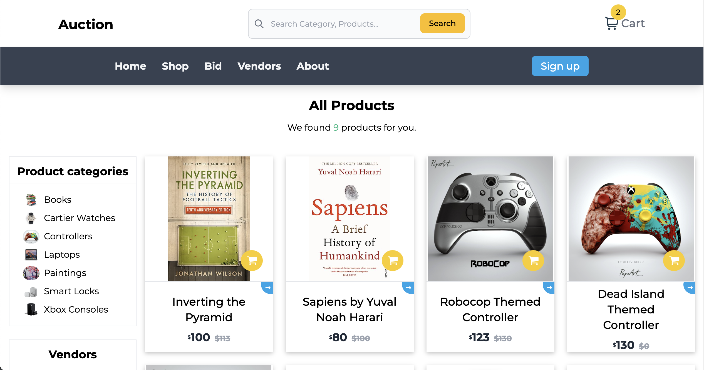

# This is an Online Auction Website
---

some screenshots of the project




clone the repo or download it 

create virtual environment in python within the auction folder
```
python -m venv .
```

activate the virtual environment
```
source bin/activate
```

install the requirements
```
pip install -r requirements.txt
```

migrate all the migrations
```
python manage.py migrate
```

finally run the sever
```
python manage.py runserver
```