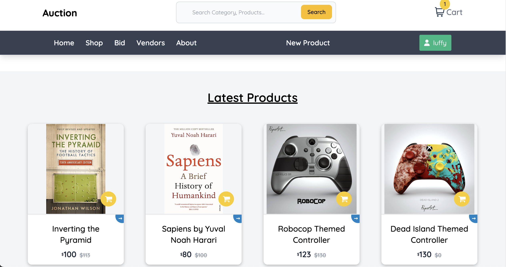
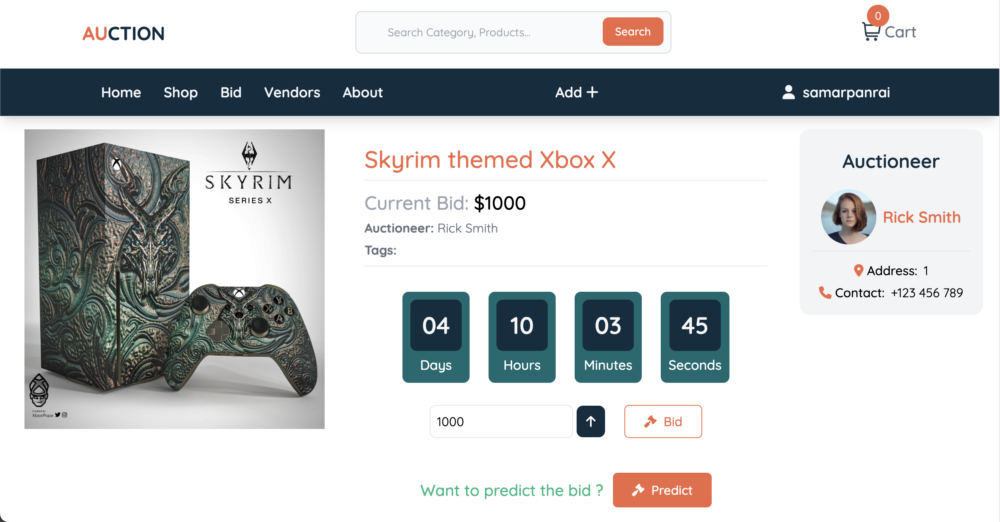
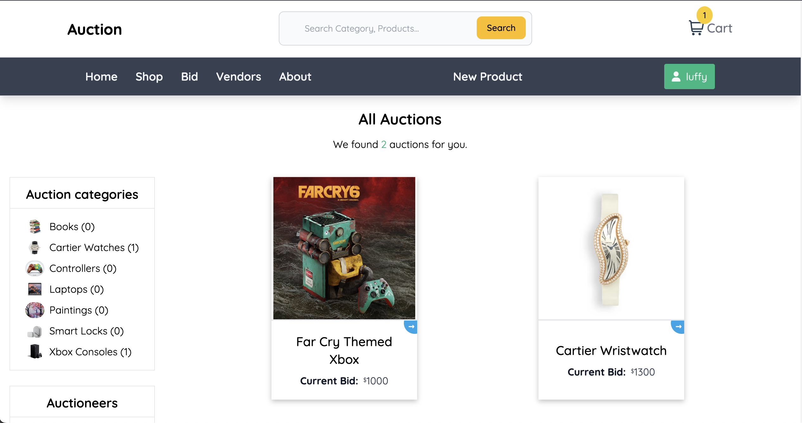
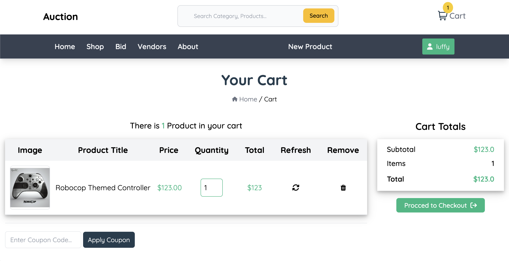
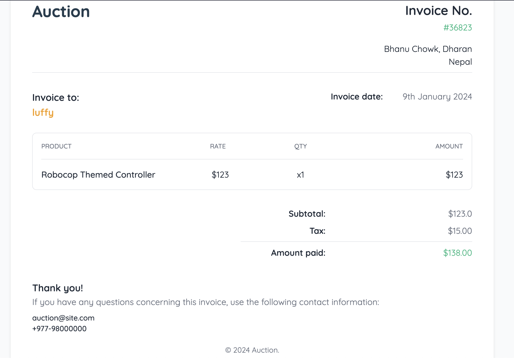

# This is an Online Auction + E-commerce Website

This project integrates features from both an auction system and a traditional e-commerce platform. Customers have the flexibility to either make direct purchases of desired products or participate in bidding for the items they seek. 

Some screenshots of the project












Clone the repo or download it 
---

Create virtual environment in python within the auction folder
### For Mach
```
python -m venv .
```

### For Windows
```
python3 -m venv env
```


Activate the virtual environment
### For Mac
```
source bin/activate
```
### For Windows
```
env\Scripts\activate
```


Install the requirements
```
pip install -r requirements.txt
```


Migrate all the migrations
```
python manage.py migrate
```


Finally run the server
```
python manage.py runserver
```
---


