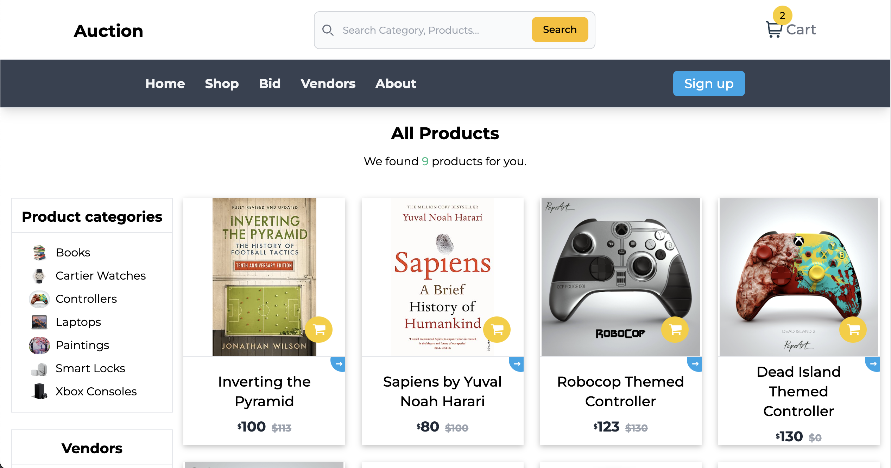
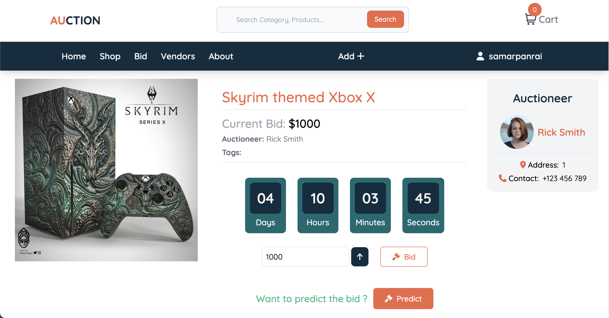
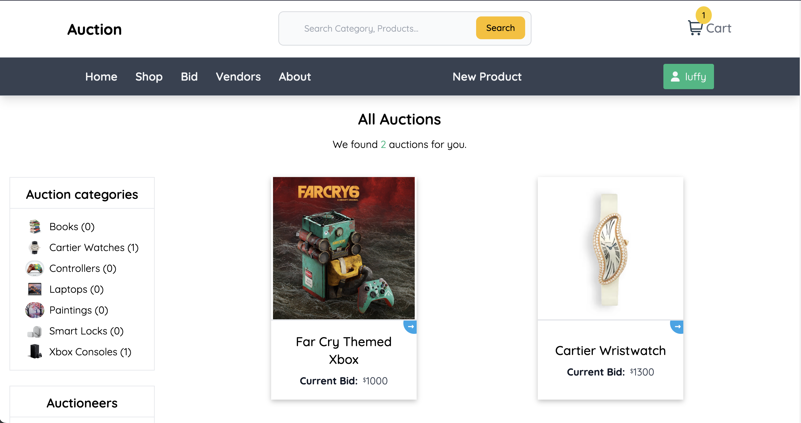
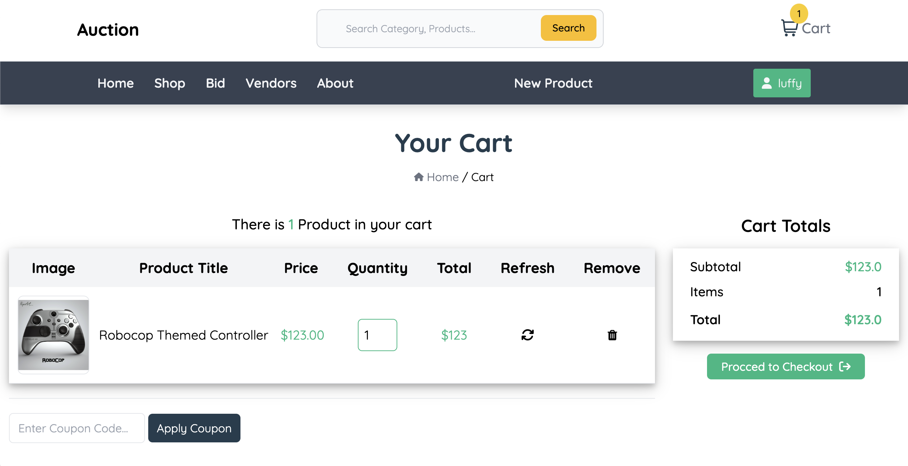
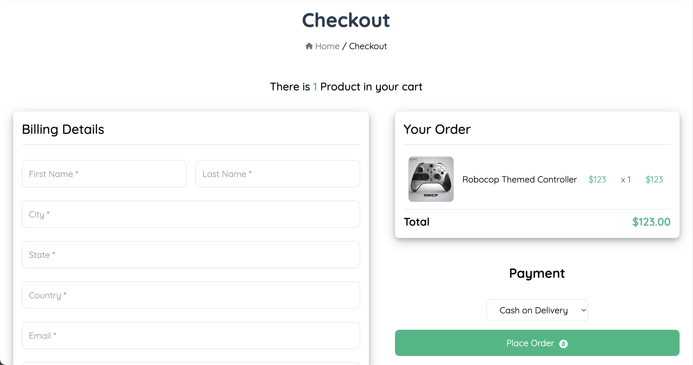
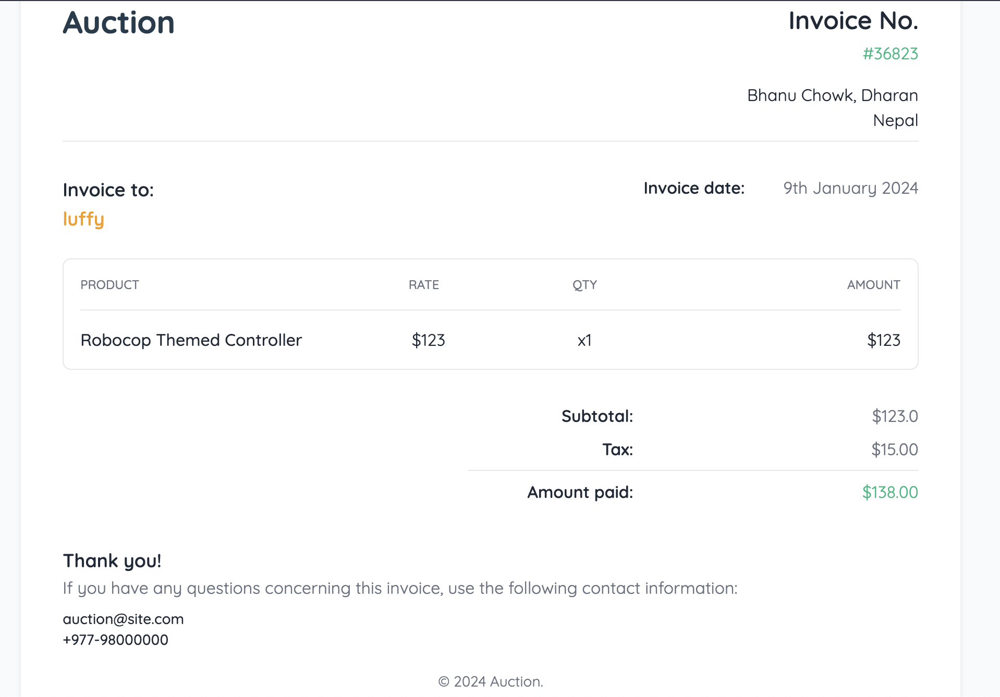

# Online Auction & E-commerce Platform

A modern hybrid marketplace that combines the excitement of auction bidding with the convenience of traditional e-commerce shopping. Users can either purchase items directly at fixed prices or participate in competitive bidding to secure the best deals.

## Overview

This platform addresses the growing demand for flexible online shopping experiences by offering customers two distinct purchasing paths on a single platform. Whether you prefer the certainty of immediate purchases or the thrill of auction bidding, our marketplace accommodates both shopping preferences seamlessly.

The integration of AI-powered bid prediction helps users make informed decisions during auction participation, setting this platform apart from traditional auction sites.

## Key Features

### Dual Purchase Options
- **Direct Purchase**: Buy items immediately at listed prices
- **Auction Bidding**: Participate in timed auctions for potentially better deals
- **Flexible Listings**: Sellers can choose between fixed-price and auction formats

### Smart Bid Prediction
- AI-driven price forecasting for auction items
- Historical data analysis to predict final bid amounts
- Real-time probability calculations based on current bidding patterns

### User Experience
- Intuitive interface designed for both shopping modes
- Responsive design optimized for desktop and mobile devices
- Real-time auction updates and notifications
- Comprehensive search and filtering capabilities

## Technology Stack

Based on the project structure, this platform utilizes:

- **Frontend**: HTML, CSS & JavaScript with Tailwind CSS for styling
- **Backend**: Python-based server architecture
- **Machine Learning**: Custom bid prediction model (LRModel.pkl)
- **Static Assets**: Organized media and template management
- **Authentication**: Dedicated user authentication system

## Getting Started

### Prerequisites

Ensure you have the following installed:
- Python 3.8 or higher
- Node.js and npm
- Git

### Installation

1. Clone the repository
```bash
git clone https://github.com/samarpan-rai11/auction-marketplace.git
cd auction-ecommerce-platform
```

2. Create and activate a virtual environment
```bash
# Create virtual environment
python -m venv auction_env

# Activate virtual environment
# On Windows:
auction_env\Scripts\activate

# On macOS/Linux:
source auction_env/bin/activate
```

3. Install Python dependencies
```bash
pip install -r requirements.txt
```

4. Set up the database and run migrations
```bash
python manage.py migrate
```

5. Install frontend dependencies (if applicable)
```bash
npm install
```

6. Start the development server
```bash
python manage.py runserver
```

The application will be available at `http://localhost:8000`

## Usage

### For Buyers
1. **Browse Products**: Navigate through categories or use the search function
2. **Choose Purchase Method**: Select either "Buy Now" for immediate purchase or "Place Bid" for auction items
3. **Bid Prediction**: Use the AI prediction feature to estimate final auction prices
4. **Complete Purchase**: Follow the checkout process for your chosen items

### For Sellers
1. **List Items**: Create product listings with detailed descriptions and images
2. **Choose Selling Format**: Select between fixed-price sales or auction format
3. **Manage Listings**: Monitor bids, respond to inquiries, and update inventory
4. **Process Orders**: Handle fulfillment and shipping for sold items

### Administrative Features
- User account management
- Transaction monitoring
- Platform analytics and reporting
- Content moderation tools

## Bid Prediction Feature

The integrated machine learning model analyzes multiple factors to provide accurate price predictions:

- Historical auction data for similar items
- Current bidding velocity and patterns
- Time remaining in auction
- Seasonal market trends
- User engagement metrics

This feature helps users make strategic bidding decisions and improves overall platform engagement.

## Project Structure

```
├── assets/         # Static assets and media files
├── auction/        # Auction-specific functionality
├── core/           # Core platform features
├── media/          # User-uploaded content
├── product/        # Product catalog management
├── static/         # Static CSS, JS, and image files
├── templates/      # HTML templates
├── userauth/       # User authentication system
├── LRModel.pkl     # Machine learning model for bid prediction
├── manage.py       # Django management script
└── requirements.txt # Python dependencies
```

## Contributing

We welcome contributions to improve the platform! Please follow these steps:

1. Fork the repository
2. Create a feature branch (`git checkout -b feature/amazing-feature`)
3. Commit your changes (`git commit -m 'Add amazing feature'`)
4. Push to the branch (`git push origin feature/amazing-feature`)
5. Open a Pull Request

### Development Guidelines
- Follow PEP 8 coding standards for Python code
- Ensure all new features include appropriate tests
- Update documentation for any new functionality
- Test across different browsers and devices

## Screenshots

*Screenshots showcasing the platform's interface and features are available in the repository.*













## Support

If you encounter any issues or have questions:

1. Check the existing [Issues](https://github.com/samarpan-rai11/auction-marketplace/issues) for similar problems
2. Create a new issue with detailed information about your problem

## License

This project is licensed under the MIT License - see the [LICENSE](LICENSE) file for details.

## Acknowledgments

- Thanks to all contributors who have helped shape this platform
- Special appreciation for the open-source community tools that made this project possible
- Recognition of the machine learning libraries that power our prediction algorithms

---
